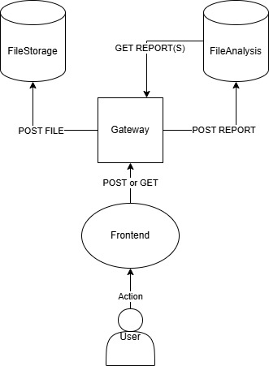

# AntiplagService (КПО_ДЗ_3)

## Описание
Распределенная информационная система для автоматической проверки студенческих работ на наличие заимствований. Система принимает файлы, организует их хранение, проводит анализ текста на схожесть с ранее сданными работами и предоставляет визуальную аналитику.

Решение построено на **микросервисной архитектуре** с использованием .NET 9, Docker-контейнеризации и мини-фронтенда на Blazor WebAssembly.

---

## Quick Start (Инструкция по запуску)

### Требования
- Docker Desktop (установленный и запущенный)

### Запуск приложения

1. **Клонируйте репозиторий**. 
2. **Откройте терминал** в корневой папке решения.
3. **Запустите сборку и старт контейнеров**:
   ```bash
   docker compose up --build
   ```
4. **Дождитесь запуска** - в первый раз может быть долгим (до 4х минут). Docker скачает необходимые образы, соберет проекты и запустит 4 контейнера.

### Адреса сервисов после запуска:

| Сервис | URL (в браузере) | Описание |
|---|---|---|
| **Frontend** | `http://localhost` | **Главная точка входа для пользователя** |
| **Gateway** | `http://localhost:5000/swagger` | Сервис взаимодействия |
| FileStorage | `http://localhost:5001/swagger` | Внутренний сервис хранения |
| FileAnalysis | `http://localhost:5002/swagger` | Внутренний сервис аналитики |
---

## Архитектура решения

Система разделена на независимые микросервисы согласно принципу Single Responsibility:

1. **Frontend**:
   - Клиентское приложение, работает в браузере.
   - Общается **только** с Gateway.
   - Реализует сценарии студента (загрузка) и преподавателя (дашборд с результатами).
   - Визуализирует облако слов (можно посмотреть в "детали" загруженной работы во вкладке преподаватель).

2. **API Gateway**:
   - Единая точка входа.
   - Маршрутизирует запросы к `FileStorage` и `FileAnalysis`.
   - **Resilience**: Реализует паттерны Retry и Circuit Breaker (через Polly) для обработки недоступности микросервисов. Возвращает понятные 503 ошибки вместо падения.

3. **FileStorage Service**:
   - Отвечает **только** за физическое хранение файлов и их метаданных.
   - In-Memory БД (после перезапуска все теряется)

4. **FileAnalysis Service**:
   - Отвечает **только** за логику проверки на плагиат.
   - Хранит тексты документов и результаты проверок (Reports).
   - In-Memory БД (после перезапуска все теряется)

5. **Shared**:
   - Библиотека с общими моделями данных(`AnalysisResult`, `FileData`), используемая всеми сервисами для обмена данными.

---

## User Flow (Сценарии использования)

### 1. Студент (Сдача работы)
1. Пользователь заполняет форму: Имя, Название задания, Файл (.txt).
2. **Frontend** отправляет POST запрос на Gateway.
3. **Gateway** передает файл в **FileStorage** -> получает ID файла.
4. **Gateway** передает ID и данные в **FileAnalysis** -> запускается проверка.
5. Результат возвращается студенту мгновенно.

### 2. Преподаватель (Проверка)
1. Заходит на страницу поиска.
2. Вводит название задания (например, `Lab1`).
3. **Frontend** запрашивает у Gateway отчеты по этому заданию.
4. **Gateway** запрашивает данные у **FileAnalysis**.
5. Отображается список студентов со статусами (`Принято` / `Плагиат`).
6. При клике на детали загружается **Облако слов** (интеграция с QuickChart API).

---

## Алгоритм определения плагиата

Логика реализована в классе `PlagDetector` сервиса Analysis:

1. Извлечение чистого текста из байтов файла.
2. Выборка из БД только тех работ, которые сданы по **тому же заданию** (`AssignmentName`). Это исключает ложные срабатывания между разными лабораторными.
3. Разбиение текста на слова, приведение к нижнему регистру, удаление знаков препинания.
4. Вычисление Пересечение слов / Объединение слов.
5. : Если схожесть `> 60%`, ставится флаг `IsPlag = true`.
6. Генерация частотного словаря (`TopWords`) для построения облака слов.

---

## Чистый код

При разработке соблюдались архитектурные принципы:

### SOLID
1. **SRP (Single Responsibility)**:
   - Каждый микросервис имеет свою зону ответственности и свою БД.
   - `TextExtractor` занимается только текстом, `PlagDetector` — только математикой.
2. **OCP (Open-Closed)**:
   - Алгоритм сравнения изолирован; можно добавить поддержку PDF в `TextExtractor`, не меняя логику контроллеров.
3. **DIP (Dependency Inversion)**:
   - Внедрение зависимостей через конструктор (DI Container) во всех сервисах.
   - Использование `HttpClient` через фабрики (`IHttpClientFactory`) и типизированные клиенты.

Микросервисная архиктетура с сервисом взаимодействия

<p align="center">
  
</p>

---

## Структура проекта

```text
AntiplagService/
├── Gateway/                  # Проект API Gateway
│   ├── Controllers/          # Маршрутизация и агрегация
│   ├── Services/             # Http-клиенты
│   └── Dockerfile
├── Services/
│   ├── FileStorage/          # Микросервис хранения
│   │   ├── Data/             # Контекст In-Memory
│   │   └── Dockerfile
│   └── FileAnalysis/         # Микросервис анализа
│       ├── Core/             # Алгоритмы антиплагиата и облака
│       ├── Data/             # Контекст In-Memory
│       └── Dockerfile
├── Frontend/                 # Blazor WebAssembly
│   ├── Pages/                # Компоненты (Upload, Search)
│   ├── nginx.conf            # nginx для фикса Docker
│   └── Dockerfile
├── Shared/                   # Общая библиотека
├── docker-compose.yml        # Оркестрация контейнеров
└── test_files/      # файлы для тестирования
```

## Используемые NuGet пакеты

### Gateway
- **Microsoft.Extensions.Http.Polly** — реализация паттернов устойчивости (Retry, Circuit Breaker, Timeout) для стабильного общения между микросервисами.
- **Swashbuckle.AspNetCore** — генерация интерактивной документации Swagger UI.

### Services (FileStorage & FileAnalysis)
- **Swashbuckle.AspNetCore** — генерация интерактивной документации Swagger UI.
- **Microsoft.EntityFrameworkCore.Tools** — инструменты для создания и применения моделей

### Frontend (Blazor WASM)
- **Microsoft.AspNetCore.Components.WebAssembly** — основной фреймворк для запуска C# кода в браузере.
- **System.Net.Http.Json** — методы расширения для удобной отправки и получения JSON-данных от Gateway API.